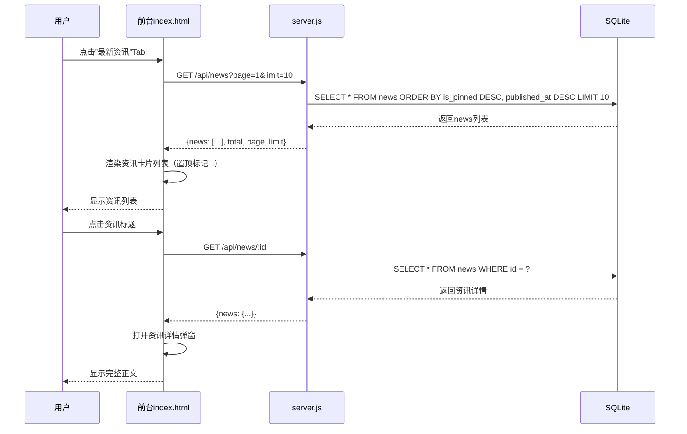
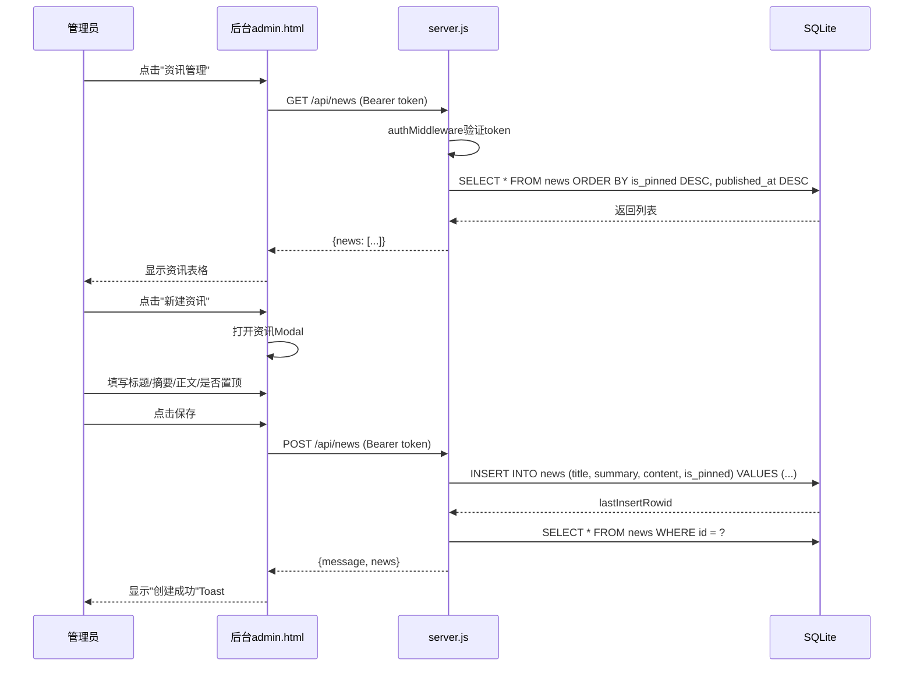
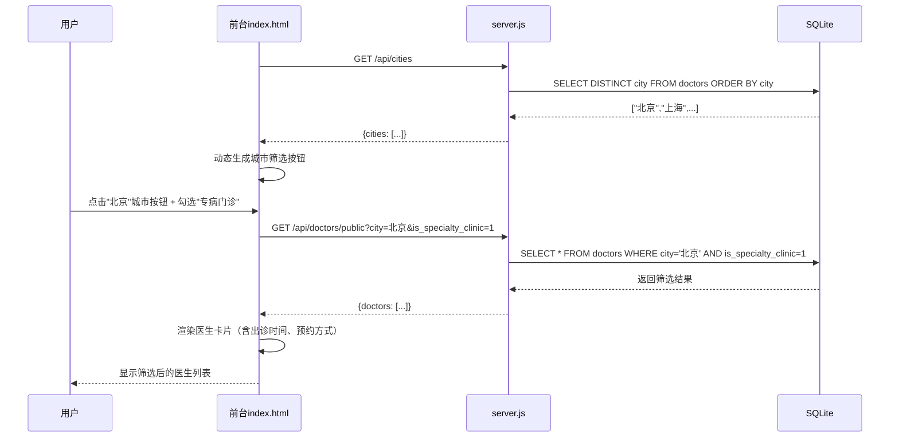
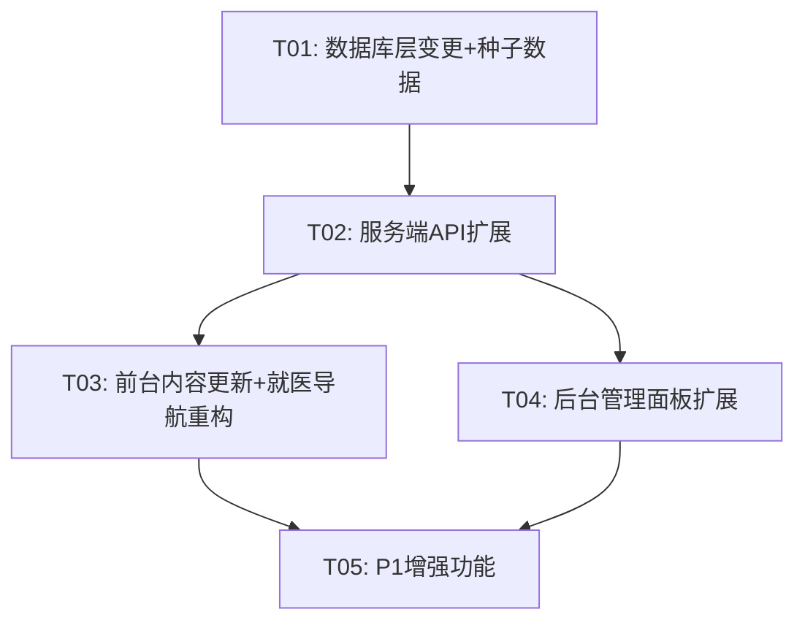

# 白塞联盟官网 — 增量更新系统架构设计

> 架构师：高见远（Gao）  
> 日期：2025-05-30  
> 版本：v1.0

---

## 1. 实现方案 + 框架选型

### 1.1 核心技术决策

**沿用现有技术栈，不引入新框架。** 理由如下：

| 维度 | 现状 | 决策 |
|------|------|------|
| 后端 | Node.js + Express + better-sqlite3 | ✅ 沿用，新增资讯CRUD路由、迁移doctors表字段 |
| 前端 | 原生HTML/CSS/JS 单页应用 | ✅ 沿用，新增资讯Tab、扩展就医导航、更新内容 |
| 认证 | JWT (jsonwebtoken) | ✅ 沿用，资讯CRUD复用现有authMiddleware |
| 数据库 | SQLite (better-sqlite3) | ✅ 沿用，新增news表、doctors表ALTER新增4列 |

### 1.2 核心技术挑战

1. **doctors表结构变更**：SQLite不支持`ALTER TABLE ADD COLUMN`带`DEFAULT`的某些场景，需用`ALTER TABLE`逐列添加，并为已有行填充默认值
2. **前台就医导航从硬编码改为API动态加载**：当前医生卡片全部硬编码在HTML中，需改为`fetch('/api/doctors/public')`动态渲染
3. **资讯模块全栈新增**：数据库表、服务端CRUD、前台Tab+列表+详情、后台管理面板——四层同步
4. **城市筛选扩展至20+城市**：从4个硬编码按钮改为动态从数据库获取城市列表
5. **富文本编辑（P1-3）**：在原生JS环境下引入轻量级富文本编辑器（如Quill），或使用`contenteditable`配合简易工具栏

### 1.3 新增依赖

| 包名 | 用途 | 版本 |
|------|------|------|
| quill | 后台资讯管理富文本编辑器（P1-3） | ^2.0.x |

> 仅P1-3需要，P0不引入新依赖。

---

## 2. 文件列表及相对路径

| 文件路径 | 变更类型 | 职责说明 |
|----------|----------|----------|
| `database.js` | 修改 | 新增news表DDL、doctors表ALTER新增4列、新增14位专病门诊医生种子数据、新增资讯种子数据 |
| `server.js` | 修改 | 新增`/api/news` CRUD路由（5个接口）、新增`/api/doctors/public`公开接口、新增`/api/cities`公开接口、修改`/api/doctors`写操作适配新字段、修改`/api/dashboard`增加news统计 |
| `index.html` | 修改 | 首页hero区域替换真实简介、知识库新增"最新资讯"Tab+资讯列表+资讯详情弹窗、就医导航改为API动态加载+城市筛选扩展+专病门诊筛选+医生卡片新增字段展示、关于我们全文更新+发展历程时间线、i18n数据更新 |
| `admin.html` | 修改 | 侧边栏新增"资讯管理"导航项、新增资讯管理页面（列表+Modal CRUD）、医生管理表单适配新增4个字段（schedule/appointment_info/is_specialty_clinic/title）、仪表盘新增资讯统计卡片 |
| `seed-doctors.js` | 新建 | 医生数据批量导入/初始化脚本（14位专病门诊专家 + 推荐医生数据） |
| `docs/system_design.md` | 新建 | 本文档 |
| `docs/sequence-diagram.mermaid` | 新建 | 时序图 |
| `docs/class-diagram.mermaid` | 新建 | 类图 |

---

## 3. 数据结构和接口

### 3.1 新增表DDL

#### news 表（资讯）

```sql
CREATE TABLE IF NOT EXISTS news (
  id INTEGER PRIMARY KEY AUTOINCREMENT,
  title TEXT NOT NULL DEFAULT '',
  summary TEXT NOT NULL DEFAULT '',        -- 摘要
  content TEXT NOT NULL DEFAULT '',         -- 正文（支持HTML，为P1-3富文本预留）
  published_at TEXT DEFAULT (datetime('now', 'localtime')),  -- 发布时间
  is_pinned INTEGER NOT NULL DEFAULT 0,    -- 是否置顶（0/1）
  created_at TEXT DEFAULT (datetime('now', 'localtime')),
  updated_at TEXT DEFAULT (datetime('now', 'localtime'))
);
```

### 3.2 doctors 表新增字段

```sql
ALTER TABLE doctors ADD COLUMN title TEXT NOT NULL DEFAULT '';                   -- 职称（如：教授、副教授、主任、副主任、博士）
ALTER TABLE doctors ADD COLUMN schedule TEXT NOT NULL DEFAULT '';                -- 出诊时间（如：周二下午/周四上午）
ALTER TABLE doctors ADD COLUMN appointment_info TEXT NOT NULL DEFAULT '';        -- 预约方式（如：医院官方App/114预约挂号）
ALTER TABLE doctors ADD COLUMN is_specialty_clinic INTEGER NOT NULL DEFAULT 0;   -- 是否专病门诊（0/1）
```

> **迁移策略**：在`database.js`的`createTables()`函数中，使用`ALTER TABLE ... ADD COLUMN IF NOT EXISTS`模式（先查询`PRAGMA table_info(doctors)`判断列是否已存在，不存在才ALTER）。

### 3.3 新增/修改的API接口

#### 资讯相关（新增）

| 方法 | 路径 | 认证 | 说明 |
|------|------|------|------|
| GET | `/api/news` | ❌ 公开 | 获取资讯列表，支持分页参数`?page=1&limit=10`，置顶优先+发布时间倒序 |
| GET | `/api/news/:id` | ❌ 公开 | 获取资讯详情 |
| POST | `/api/news` | ✅ 需认证 | 创建资讯 |
| PUT | `/api/news/:id` | ✅ 需认证 | 更新资讯 |
| DELETE | `/api/news/:id` | ✅ 需认证 | 删除资讯 |

**GET /api/news 响应格式：**

```json
{
  "news": [
    {
      "id": 1,
      "title": "5.20国际白塞病关爱日科普活动",
      "summary": "2025年5月20日，白塞联盟举办线上科普活动...",
      "content": "...",
      "published_at": "2025-05-20 10:00:00",
      "is_pinned": 1,
      "created_at": "2025-05-19 15:00:00",
      "updated_at": "2025-05-19 15:00:00"
    }
  ],
  "total": 25,
  "page": 1,
  "limit": 10
}
```

**POST /api/news 请求体：**

```json
{
  "title": "标题（必填）",
  "summary": "摘要",
  "content": "正文HTML",
  "is_pinned": 0
}
```

#### 医生相关（修改/新增）

| 方法 | 路径 | 认证 | 说明 |
|------|------|------|------|
| GET | `/api/doctors/public` | ❌ 公开 | 前台公开接口，支持`?city=北京&is_specialty_clinic=1`筛选 |
| GET | `/api/cities` | ❌ 公开 | 获取所有有医生的城市列表（去重） |
| GET | `/api/doctors` | ✅ 需认证 | 后台管理（保留，适配新字段） |
| POST | `/api/doctors` | ✅ 需认证 | 后台新增（适配新字段） |
| PUT | `/api/doctors/:id` | ✅ 需认证 | 后台更新（适配新字段） |

**GET /api/doctors/public 响应格式：**

```json
{
  "doctors": [
    {
      "id": 1,
      "name_zh": "管剑龙 教授",
      "title": "教授",
      "hospital": "上海华东医院",
      "department": "风湿免疫科",
      "specialty_zh": "白塞病专病门诊",
      "city": "上海",
      "schedule": "周二下午/周四上午",
      "appointment_info": "医院官方App预约",
      "is_specialty_clinic": 1
    }
  ]
}
```

**GET /api/cities 响应格式：**

```json
{
  "cities": ["北京", "上海", "广州", "成都", "天津", "浙江", ...]
}
```

#### 仪表盘（修改）

| 方法 | 路径 | 认证 | 说明 |
|------|------|------|------|
| GET | `/api/dashboard` | ✅ 需认证 | 增加`news`计数和最近资讯更新记录 |

---

## 4. 程序调用流程

### 4.1 前台加载资讯列表



### 4.2 后台管理资讯CRUD



### 4.3 前台就医导航城市筛选



---

## 5. 任务列表

### T01: 数据库层变更 + 种子数据

- **任务ID**: T01
- **任务描述**: 新增news表DDL、doctors表ALTER新增4列（含迁移兼容逻辑）、替换医生种子数据为14位真实专家、新增资讯种子数据、新建seed-doctors.js批量导入脚本
- **涉及文件**: `database.js`, `seed-doctors.js`（新建）
- **依赖任务**: 无
- **预估复杂度**: M
- **优先级**: P0

### T02: 服务端API扩展

- **任务ID**: T02
- **任务描述**: server.js新增资讯CRUD 5个接口、新增公开接口`/api/doctors/public`和`/api/cities`、修改doctors写操作适配新字段、修改dashboard接口增加news统计
- **涉及文件**: `server.js`
- **依赖任务**: T01
- **预估复杂度**: M
- **优先级**: P0

### T03: 前台内容更新 + 就医导航重构

- **任务ID**: T03
- **任务描述**: 首页hero区域替换为真实组织简介、关于我们全文更新（组织简介+使命愿景+发展历程时间线+联系方式）、就医导航改为API动态加载+城市筛选扩展20+城市+专病门诊筛选+医生卡片展示出诊时间/预约方式/职称/专病门诊标识、知识库新增"最新资讯"Tab（列表+详情弹窗）、i18n数据更新
- **涉及文件**: `index.html`
- **依赖任务**: T02
- **预估复杂度**: L
- **优先级**: P0

### T04: 后台管理面板扩展

- **任务ID**: T04
- **任务描述**: 侧边栏新增"资讯管理"导航项、新增资讯管理页面（列表+Modal CRUD）、医生管理Modal适配新增4个字段（title/schedule/appointment_info/is_specialty_clinic）、仪表盘新增资讯统计卡片
- **涉及文件**: `admin.html`
- **依赖任务**: T02
- **预估复杂度**: M
- **优先级**: P0

### T05: P1增强功能（选择性实现）

- **任务ID**: T05
- **任务描述**: P1-1发展历程时间线组件样式增强、P1-2资讯详情页独立路由或弹窗优化、P1-3后台资讯管理富文本编辑（集成Quill）、P1-5前台医生卡片展示出诊时间和预约方式（T03已含基础版，此处为样式优化）、P1-6后台支持医生数据批量导入
- **涉及文件**: `index.html`, `admin.html`, `package.json`
- **依赖任务**: T03, T04
- **预估复杂度**: L
- **优先级**: P1

---

## 6. 依赖包列表

| 包名 | 当前版本 | 是否需要新增 | 用途 |
|------|----------|-------------|------|
| express | ^4.21.0 | ❌ 沿用 | Web框架 |
| better-sqlite3 | ^11.6.0 | ❌ 沿用 | SQLite驱动 |
| jsonwebtoken | ^9.0.2 | ❌ 沿用 | JWT认证 |
| bcryptjs | ^2.4.3 | ❌ 沿用 | 密码加密 |
| cors | ^2.8.5 | ❌ 沿用 | 跨域支持 |
| quill | - | ✅ 新增（仅P1-3） | 富文本编辑器 |

> **P0无需新增任何npm依赖。** quill仅在P1-3富文本编辑时引入。

---

## 7. 共享知识

### 7.1 资讯API排序规则

- 列表查询固定排序：`ORDER BY is_pinned DESC, published_at DESC`
- 置顶资讯优先显示，同级别按发布时间倒序

### 7.2 城市列表维护方式

- 前台城市筛选按钮从`GET /api/cities`动态获取，不再硬编码
- 城市列表来源：`SELECT DISTINCT city FROM doctors ORDER BY city`
- 后台医生管理表单的城市字段为自由文本输入（不做城市下拉约束），保持灵活性

### 7.3 医生数据初始化策略

- **P0**：在`database.js`的`seedData()`中替换7位虚构医生为14位真实专病门诊专家
- **P1-4/P1-6**：新建`seed-doctors.js`脚本，包含20+城市100+医生的批量导入数据，使用`db.transaction()`批量INSERT
- 种子数据逻辑：`if doctorCount === 0`才插入，避免重复

### 7.4 API响应格式约定

- 成功响应：`{ message: "操作成功", data: {...} }` 或 `{ items: [...] }`
- 错误响应：`{ error: "错误描述" }`，HTTP状态码语义化（400/401/404/500）
- 公开GET接口无需认证，所有写操作（POST/PUT/DELETE）需JWT认证

### 7.5 前台公开接口清单

| 路径 | 说明 |
|------|------|
| `GET /api/news` | 资讯列表 |
| `GET /api/news/:id` | 资讯详情 |
| `GET /api/doctors/public` | 医生列表（带筛选） |
| `GET /api/cities` | 城市列表 |
| `POST /api/auth/login` | 登录 |

### 7.6 doctors表字段映射（新增字段）

| 数据库字段 | 后台表单字段 | 前台展示位置 | 类型 |
|-----------|-------------|-------------|------|
| title | 职称 | 医生卡片标题旁 | TEXT |
| schedule | 出诊时间 | 医生卡片详情行 | TEXT |
| appointment_info | 预约方式 | 医生卡片详情行 | TEXT |
| is_specialty_clinic | 是否专病门诊 | 医生卡片标签 | INTEGER(0/1) |

### 7.7 专病门诊医生数据（14位）

用于替换`database.js`中的虚构医生种子数据：

```javascript
const specialtyDoctors = [
  { city: '上海', hospital: '上海华东医院', department: '风湿免疫科', name_zh: '管剑龙 教授', title: '教授', specialty_zh: '白塞病专病门诊', schedule: '周二下午/周四上午', is_specialty_clinic: 1 },
  { city: '上海', hospital: '上海仁济医院', department: '风湿科', name_zh: '仁济风湿科专病门诊', title: '', specialty_zh: '白塞病专病门诊', schedule: '每周二上午', is_specialty_clinic: 1 },
  { city: '北京', hospital: '北京协和医院', department: '免疫内科', name_zh: '郑文洁教授&刘金晶大夫', title: '教授', specialty_zh: '白塞病专病门诊', schedule: '每周三上午', is_specialty_clinic: 1 },
  { city: '北京', hospital: '北京大学第一医院', department: '风湿免疫科', name_zh: '张卓莉 教授', title: '教授', specialty_zh: '白塞病专病门诊', schedule: '每周四上午', is_specialty_clinic: 1 },
  { city: '北京', hospital: '北京中医医院', department: '干部保健科', name_zh: '张海滨 主任', title: '主任医师', specialty_zh: '白塞病专病门诊', schedule: '每周三上午', is_specialty_clinic: 1 },
  { city: '北京', hospital: '北京朝阳医院', department: '眼科', name_zh: '陶勇 教授', title: '教授', specialty_zh: '白塞病眼部专病门诊', schedule: '每周一下午', is_specialty_clinic: 1 },
  { city: '上海', hospital: '上海仁济医院', department: '眼科', name_zh: '闫焱 医生', title: '', specialty_zh: '白塞病眼部专病门诊', schedule: '', is_specialty_clinic: 1 },
  { city: '上海', hospital: '上海市中医医院', department: '风湿免疫科', name_zh: '陈薇薇 副主任', title: '副主任医师', specialty_zh: '白塞病专病门诊', schedule: '周五上午', is_specialty_clinic: 1 },
  { city: '北京', hospital: '北京西苑中医院', department: '风湿免疫科', name_zh: '周彩云 教授', title: '教授', specialty_zh: '白塞病专病门诊', schedule: '周五上午', is_specialty_clinic: 1 },
  { city: '北京', hospital: '北京大学人民医院', department: '风湿免疫科', name_zh: '穆荣 教授', title: '教授', specialty_zh: '白塞病专病门诊', schedule: '周三全天', is_specialty_clinic: 1 },
  { city: '北京', hospital: '北京大学人民医院', department: '风湿免疫科', name_zh: '刘田 副主任', title: '副主任医师', specialty_zh: '白塞病专病门诊', schedule: '每周五下午', is_specialty_clinic: 1 },
  { city: '成都', hospital: '四川华西医院', department: '风湿免疫科', name_zh: '刘毅 教授', title: '教授', specialty_zh: '白塞病专病门诊', schedule: '周一下午/周二上午(特需)/周三上午', is_specialty_clinic: 1 },
  { city: '北京', hospital: '北京协和医院', department: '眼科', name_zh: '赵潺 博士', title: '博士', specialty_zh: '白塞病眼部专病门诊', schedule: '', is_specialty_clinic: 1 },
  { city: '北京', hospital: '北京安贞医院', department: '心脏大血管外科', name_zh: '郑军 教授团队', title: '教授', specialty_zh: '白塞病合并心脏大血管MDT门诊', schedule: '周二下午', is_specialty_clinic: 1 },
];
```

### 7.8 关于我们内容数据

**组织简介：**
白塞联盟（Behcet's Disease Alliance）成立于2005年5月，是由白塞氏病患者和家属自发成立的互助公益组织。2014年5月，联盟在北京市民政局正式注册成为民非公益组织。联盟宗旨是为白塞病患者提供关怀、救助、信息咨询及调查研究服务。

**发展历程（2005-2018，15个关键节点）：**
需以时间线组件形式展示，具体年份事件内容需产品经理确认详细文案。

**联系方式：**
- 官网：www.behcet.com.cn
- 微博：@白塞联盟
- 微信：baisailianmeng2005
- 邮箱：admin@behcet.com.cn

---

## 8. 待明确事项

1. **发展历程时间线内容**：PRD提到2005-2018共15个关键节点，但未给出每个节点的具体内容。需产品经理补充完整的发展历程事件列表。

2. **推荐医生数据（P1-4）**：PRD提到20+城市100+医生，但仅给出了专病门诊14位的详细数据。推荐医生的详细列表（姓名、医院、科室、专长等）需产品经理提供。

3. **资讯种子数据**：初始需要多少条资讯种子数据？内容是什么？建议至少3-5条，包含一条置顶资讯（如5.20国际白塞病关爱日相关活动）。

4. **富文本编辑器选型（P1-3）**：建议使用Quill.js，但如果团队有其他偏好需要确认。Quill CDN引入方式可以避免npm install。

5. **前台医生卡片"专病门诊"标签样式**：需要确认是否使用特殊颜色/图标标识，还是复用现有的badge样式。

6. **数据迁移策略**：doctors表已有7条虚构数据，P0-7要求替换为14位真实数据。策略是：(a) 删除所有旧数据后插入新数据，还是 (b) 保留旧数据额外插入新数据？建议(a)——删除旧数据，插入14位真实专家。

---

## 9. 任务依赖图



**关键路径**：T01 → T02 → T03（前台变更最多，复杂度最高）

**并行机会**：T03和T04在T02完成后可并行开发。
